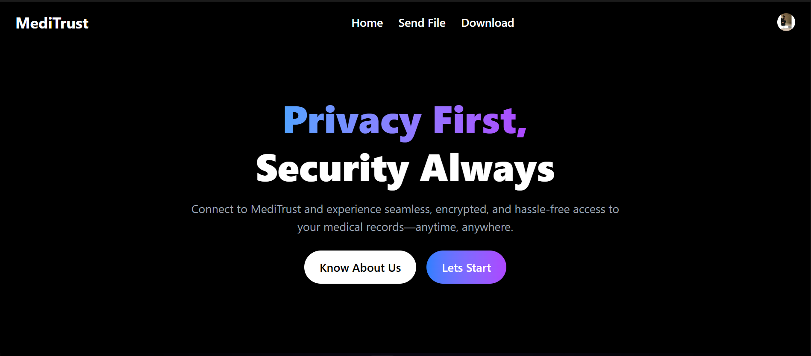

# 📦 Encrypt & Upload File Securely

A full-stack solution to **encrypt, upload, and download files securely** using **AES encryption**, **Amazon S3**, and **RDS (MySQL/PostgreSQL)**. Built with **React**, **Node.js**, and **AWS**.

---

## 📸 Preview

> 🖼️ Replace these URLs with real screenshots from your app  
| Upload Interface | Drag & Drop | Progress & Download |
|------------------|-------------|----------------------|
|  |  |  |

---

## 🚀 Features

- 🔐 **AES Encryption** using CryptoJS (password protected)
- 📂 **Drag & Drop Upload**
- 📶 **Real-Time Upload Progress Bar**
- ☁️ **Amazon S3 Storage**
- 🧾 **Metadata storage in RDS (MySQL/PostgreSQL)**
- 📥 **Secure File Download & Decryption**

---

## 🧰 Tech Stack

| Frontend         | Backend            | Cloud Storage | Database                    |
|------------------|--------------------|---------------|-----------------------------|
| React            | Node.js + Express  | Amazon S3     | Amazon RDS (MySQL/PostgreSQL) |
| Tailwind CSS     | Multer + AWS SDK   |               |                             |
| CryptoJS + Axios |                    |               |                             |

---

## 📦 Project Structure

## Installation & Setup
### Prerequisites
- Node.js installed
- AWS S3 bucket and IAM credentials
- RDS instance configured

### Backend Setup
1. Clone the repository:
   ```bash
   git clone https://github.com/your-repo.git
   cd your-repo/backend
   ```
2. Install dependencies:
   ```bash
   npm install
   ```
3. Set up environment variables in a `.env` file:
   ```env
   DB_HOST=your_db_host
   DB_USER=your_db_user
   DB_PASS=your_db_password
   DB_NAME=your_db_name
   AWS_ACCESS_KEY=your_aws_access_key
   AWS_SECRET_KEY=your_aws_secret_key
   S3_BUCKET_NAME=your_s3_bucket_name
   ```
4. Start the backend server:
   ```bash
   node server.js
   ```

### Frontend Setup
1. Navigate to the frontend folder:
   ```bash
   cd ../frontend
   ```
2. Install dependencies:
   ```bash
   npm install
   ```
3. Start the React app:
   ```bash
   npm run dev
   ```

## Usage
1. Open the web application in your browser.
2. Drag and drop a file or click to select one.
3. Enter a password for encryption.
4. Click **Upload to S3** to encrypt and upload.
5. Download the encrypted file if needed.


## License
This project is licensed under the MIT License.


